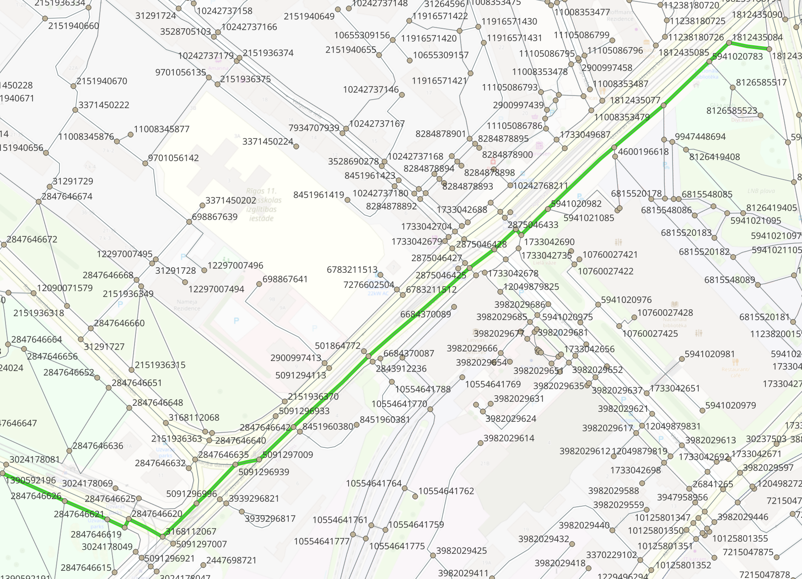
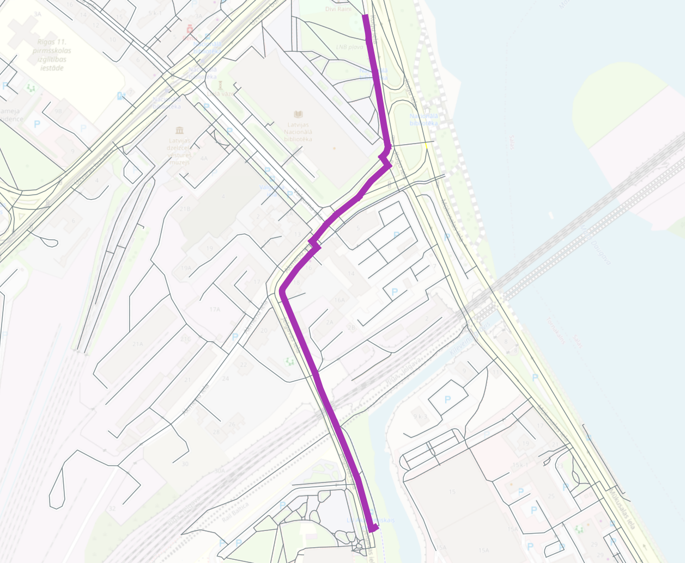

OSM Example
===========

This page includes examples of usage of the Wayfarer library with routing data taken from OpenStreetMap.

Creating a Network from OSM Data
---------------------------------

First we create a network using the `OSMnx <https://osmnx.readthedocs.io>`__ library.

.. literalinclude:: examples/create_network.py

Calculate a Route Between Two Nodes
-----------------------------------

We can easily calculate routes between two nodes, by passing in the node IDs at the start and end of the route.
We then export the route to a GeoJSON file in the EPSG:4326 projection.

.. note::

    To run this example requires **pyproj** to be installed in your Python environment.

.. literalinclude:: examples/node_to_node.py

Calculate a Route Between Two User Entered Points
-------------------------------------------------

To route between two user entered points, you can simply snap to the closest node and use the approach above. To get an exact route from start point to the end
point we need to split the network at the start and end of the route.

.. note::

    To run this example requires **Shapely** to be installed in your Python environment.

First we will take two input points, and get their closest edge, and measure along the edge. The example below is just one way to get these values,
the edge and measure could be calculated using OpenLayers in a web browser, or in a database using the geometries used to create the network.

.. literalinclude:: examples/snap_points.py

Now with an edge and measure for each point we will split the network, and route between the two user entered points to get an exact path.
Wayfarer takes care of creating the split geometries, if the network contains geometry, although this can also be handled separately using
a geospatial database to split and return features if required.

.. literalinclude:: examples/routing_example.py

The output GeoJSON file is visualised below.

